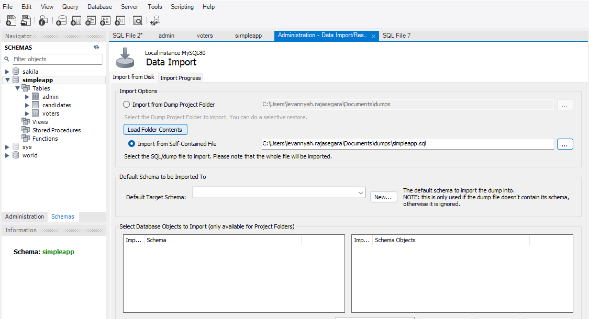
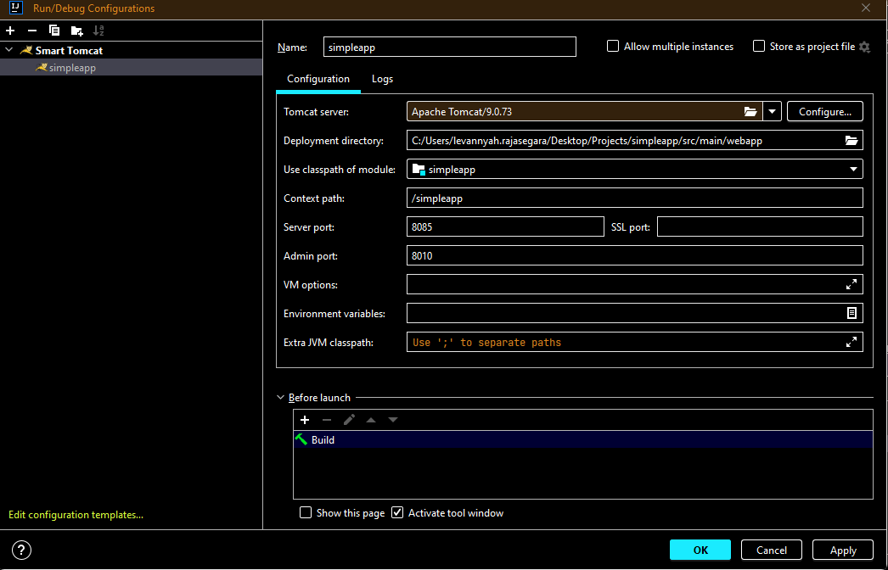

# Simple App

## About the Project
### Introduction
Simple App is a simple online voting system developed using JSF, Java EE, MySQL and Centagate APIs.

The features that are included for the admin are:
 1. Registering voters into the system.
 2. Viewing voter's details.
 3. Viewing candidate's details and number of votes received.
 4. Self-service (Update profile, Change password, Manage device).

The features that are included for the voters are:
 1. Viewing candidates' details.
 2. Voting.
 3. Self-service (View profile, Change password, Manage device). 

### Built With
1. [PrimeFaces 12.0.0](https://primefaces.github.io/primefaces/12_0_0/#/) 
2. [Materialize 1.0.0](https://materializecss.com/)

### Project Structure
There are 3 folders in the project:

 - src: the source code is in **src/main**; the backend code is in **src/main/java** and the frontend code is in **src/main/webapp**
 - target: the folder generated after running **mvn clean install**
 - db: contains the database
 
 The .xhtml files and its corresponding Managed Beans are as follows:
1. Login
	- **Check Authentication Method**: login.xhtml (Adaptive.java)
	- **Username and Password Login**: login-pwd.xhtml (Login.java)
	- **OTP Login**: login-otp.xhtml (OtpLogin.java)
	- **CR OTP Login**: login-crotp.xhtml (CrotpLogin.java)
	- **QR Code Login**: login-qr.xhtml (QrRequest.java)
	- **Push Notification Login**: login-push.xhtml (PushRequest.java)

2. Registration
	- **Voter Registration**: voters.xhtml (Voters.java)

3. Admin Self-service
	- **Update Profile**: self-serviceadmin.xhtml (UpdateProfile.java)
	- **Change Password**: self-serviceadmin.xhtml (UpdatePassword.java)
	- **Manage Device**: register-device.xhtml (UnregisterDevice.java & TokenRegistration.java)

4. Voter Self-service
	- **View Profile**: self-service.xhtml (ViewProfile.java)
	- **Change Password**: self-service.xhtml (UpdatePassword.java)
	- **Manage Device**: register-device.xhtml (UnregisterDevice.java & TokenRegistration.java)

5. Candidates
	- **Candidates Page**: index.xhtml & candidates.xhtml (Candidates.java)
	
6. Transaction Signing
	- **QR Transaction Signing**: transaction.xhtml (TransactionRequest.java)

## Getting Started

### Prerequisites
| Requirement | Purpose | URL |
|-----------------|-----------------|-----------------|
| Intellij IDEA  | IDE   | https://www.jetbrains.com/idea/download/#section=windows   |
| Java 17  | Java Version   | https://www.oracle.com/java/technologies/javase/jdk17-archive-downloads.html   |
| MySQL Workbench   | Database   | https://dev.mysql.com/downloads/workbench/   |
| Apache Tomcat 9.0   | Application Server   | https://tomcat.apache.org/download-90.cgi   |

### Set up Guidelines
1. Clone the repository to your local machine.
2. Import the simpleapp database located in the **db** folder using these [guidelines](#import-mysql-database). 
3. Setup the Tomcat server using these [guidelines](#tomcat-server-configurations).
4. Configure the settings in Centagate Cloud using these [guidelines](#configuration-in-centagate-cloud).
5. Under the **Maven** tab in Intellij, run the **mvn clean install** command.
6. Start the Tomcat server.
7. If the project is deployed successfully, the link http://localhost:8085/simpleapp will be generated in Intellij.

#### Import MySQL Database
1. After establishing a connection to the database, go to **Server > Data Import**. Choose the option **Import from Self-Contained File** and select simpleapp.sql.
2. Choose the destination database in **Default Schema to be Imported To** and select **Start Import**.

3. When the import is complete, you should see 3 tables; admin, candidates and voters.

#### Tomcat Server Configurations
1. In Intellij, install the Smart Tomcat plugin and select **Add New Configuration**.
2. Set the Server port to 8085 and the Admin port to 8010.

#### Configuration in Centagate Cloud
1. The admin uses passwordless authentication and can login using OTP, CR OTP, QR Code or Push Notification.
2. Login to [Centagate Cloud](https://cloud.centagate.com/centagate/login.xhtml) as a Company Admin, go to **Groups > Group list** and **Update** the default group. Set the 'Two-factor authentication option' to 'Always Apply' and check the OTP, CR OTP, QR Code and Push Notification' authentication options.
3. Next, **Update** the voters group and set the 'Two factor authentication option' to 'Disabled' and 'Password Complexity' to 'Must mix letters and digits'.
4. Next, go to **Self Service > Authentication Methods > Device** and register a device.
5. Then, return to **Self Service > Authentication Methods** and enable **Passwordless Authentication**. 
