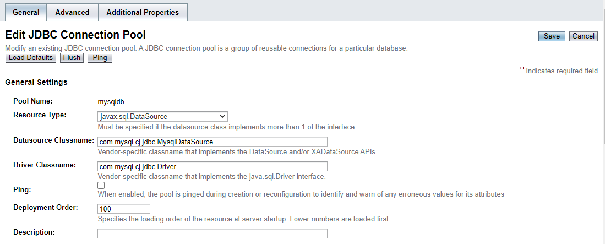
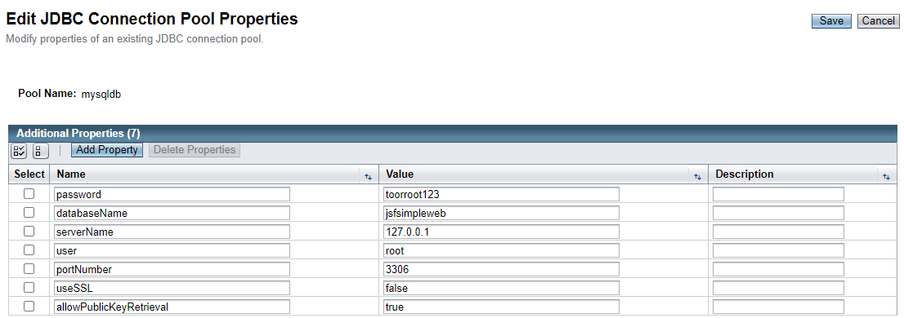
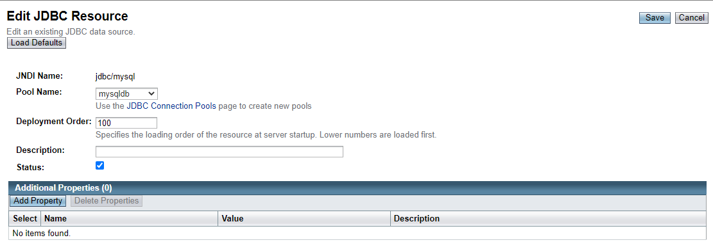
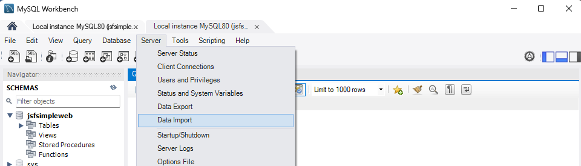

# SimpleWeb
 
## Introduction
This is a simple login and transaction authentication web application built with JSF, Java EE, MySQL and Centagate API

## Pre-requisite
There are some required technologies for this project:
1) Java 1.8 (jdk-8u202 Recommended)
2) Apache Maven 3.9.0 (Or Later)
3) Java EE 8
4) MySQL Workbench

Download Links:
- Java 1.8: https://www.oracle.com/my/java/technologies/javase/javase8-archive-downloads.html  
- Java EE 8: https://www.oracle.com/java/technologies/java-ee-sdk-download.html

## File Structure
There are three folder in the repository:
- src : source code available here
- target: generated folder after running mvn clean package
- other: packages that are required in this application

All source code can be found in **src/main**. There are two parts of the web application, frontend(xhtml) and backend(Managed Bean). All backend is stored inside **/java** file, while the frontend is in **/webapp**

In JSF, every .xhtml files has its own managed bean (.java file). Below is the corresponding Managed Bean for all pages:

1. Login Page (**index.xhtml**) - **Login.java**
2. Registration Page (**register.xhtml**) - **Registration.java**
3. Registration Page (Phone and Security Answer section) (**registermisc.xhtml**) - **RegisterMisc.java**
4. Registration Result Page (**registrationresult.xhtml**) - 
**RegistrationResult.java**
5. QR Login Authentication Page (**qrauthlogin.xhtml**) - **QRAuth.java**
6. Push Login Authentication Page (**pushauthlogin.xhtml**) - **PushAuth.java**
7. Home Page (**result.xhtml**) - **Result.java**
8. Transaction Page (**transaction.xhtml**) - **Transaction.java**
9. User Information Page (**information.xhtml**) - **Information.java**
10. Push Transaction Signing Page and QR Transaction Signing Page (**pushtransactionsign.xhtml** and **qrtransactionsign.xhtml**) - **TransactionSign.java**
> Push Transaction Signing Page and QR Transaction Signing Page use the same Managed Bean

**CentagateAPI.java** is a Java class that stores all the functions that perform Centagate API calls, and the header and footer for frontend is stored in **webapp/WEB-INF/templates** 

## Walkthrough
1. Download and configure all the [required software](#Pre-requisite)
2. Clone this repository to your local machine
3. Start the glassfish server with command **asadmin start-domain**
> Make sure you are in the glassfish directory (glassfish5/glassfish/bin), and run command prompt as administrator   
4. Type **localhost:8080** in the browser to check if the server is running
5. Configure [glassfish JDBC](#glassfish-jdbc-configuration)
6. Import database to MySQL with this [instruction](#mysql-database-configuration) 
6. In the folder of the repository, use command **mvn clean package** to create a new war file (store inside /target)
7. Back to the glassfish directory and type **asadmin deploy {directory to the repository}**
8. Go to **localhost:8080/simpleweb** if the deploy is successful. The web application should be working
 
## Glassfish JDBC Configuration
1. Add the mysql-connector-j driver (in **other** directory) to the glassfish domain's lib directory
> glassfish5\glassfish\domains\domain1\lib
2. After the server is running, type in **localhost:4848** to access the glassfish admin portal
3. In the sidebar, select **Resources->JDBC->JDBC Connection Pool**
4. Set the value as below show:

5. Leave the Pool Settings and Transaction as default, set the Additional Properties as below show:

6. Proceed to configure new JDBC Resources, click on New to add a new JDBC Resource
7. Set JNDI Name to **jdbc/mysql**, and use the pool that we created earlier as the below screenshot show:

8. You have completed the Glassfish JDBC Conguration

## MySQL Database Configuration
> The database is located in **/other** folder, and the name is called **jsfsimpleweb.sql**
1. In MySQL server, configure a new profile with host **127.0.0.1** and port **3306**, with user **root** and password **toorroot123** (You can set different values for this, but make sure you update them in [this section](#glassfish-jdbc-configuration))
2. After setup complete, in Mysql Workbench, establish connection with the profile created earlier and go to **Server->Data Import** as below show:

3. Click on **Import from Self-Contained File** and select the directory to the database, import the target schema **jsfsimpleweb** and choose **Import Progress tab**, then click **Start Import**. The database now should be imported witout any issue.

*The Centagate Console company admin name and password: **winter**, **winter123**

