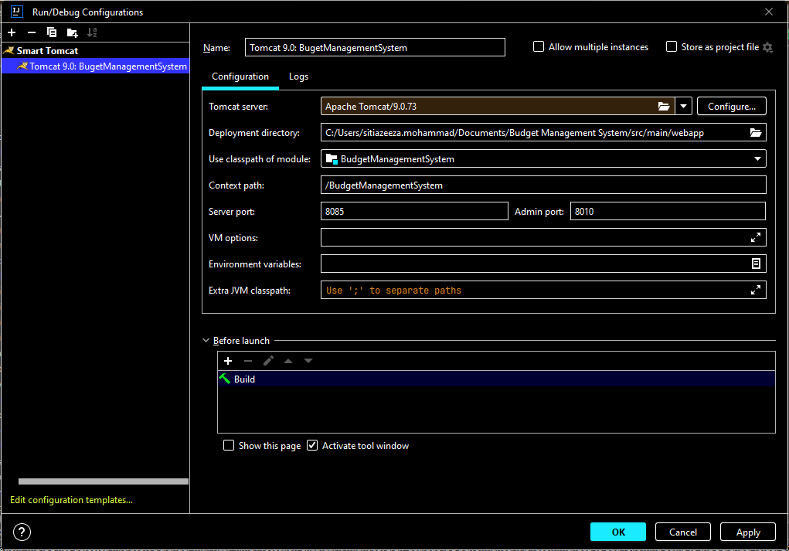
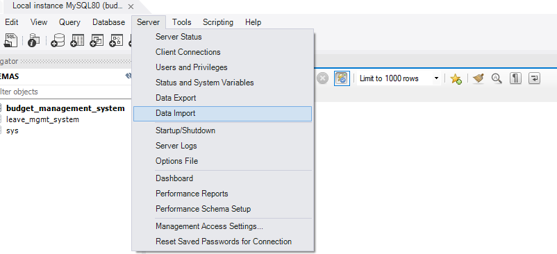
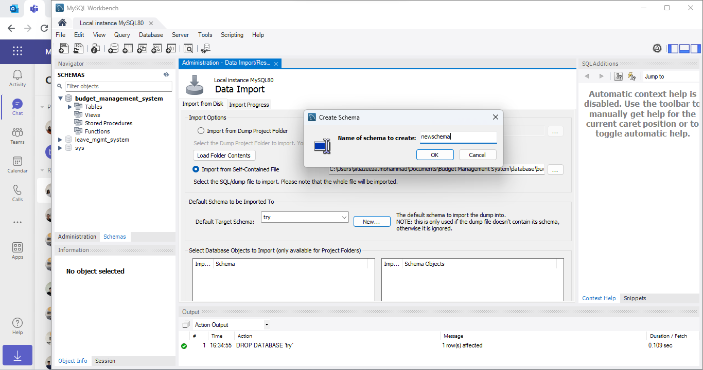

# Simple Web Application: Budget Management System

## Introduction
The Budget Management System is specifically developed to streamline the budget management process by offering an intuitive and efficient interface for both employees and administrators. This system empowers employees to easily submit budget requests, monitor their budget balances, and access their budget history. Administrators, on the other hand, have the ability to manage user accounts, configure budget types, establish approval workflows, and generate reports. Furthermore, the system is seamlessly integrated with Centagate Cloud APIs, encompassing System Management, Request Authentication, Authorize Authentication, and Transaction Signing APIs. This integration enhances the system's functionality and security, ensuring a reliable and robust solution for managing budgets.
&nbsp;&nbsp;&nbsp;&nbsp; This web application has been developed using JSF, specifically PrimeFaces, along with Java EE, MySQL, and the Centagate API.

## Pre-Requisite
The following technologies are essential for this project:
 - IntelliJ IDEA Community Edition 2023.1
 - Java 20
 - Java EE 3.0
 - Apache Maven 3.9.1 (or later)
 -  Apache Tomcat 9
 - MySQL Workbench 8.0

The tools can be downloaded using the following links:
- [IntelliJ](https://www.jetbrains.com/idea/download/?section=windows)
- [Java 20](https://www.oracle.com/my/java/technologies/downloads/)
- [Apache Maven 3.9.1](https://tomcat.apache.org/download-90.cgi)
- [Apache Tomcat 9](https://tomcat.apache.org/download-90.cgi)

## File Structure
| Folder         |Explanation                    |
|----------------|-------------------------------|
| .idea			 |This folder contains configuration files and settings specific to your project as managed by the JetBrains IDE.|
| .mvn			 |This folder contains configuration files and settings that are specific to your project's build process when using Apache Maven.|
| src			 |This folder contains source code of the project.|
| database		 |This folder contains database files.|
| target		 |This folder is automatically generated by Maven as part of the build process and serves as the output directory for compiled code.|

>**Note:** The source code can be found within the  **src** directory, which contains both the backend files (**src/main/java**) and frontend files (**src/main/webapp**).

Followings are the list of pages with their XHTML file names with its respective Java file.
| Page            				|XHTML            						|Java		   				|
|-------------------------------|---------------------------------------|---------------------------|
|Prelogin Page	  				|prelogin.xhtml							|Prelogin.java				|
|Login with Password			|loginUser.xhtml						|LoginUser.java				|
|Login with OTP					|authOtp.xhtml							|AuthOtp.java				|
|Login with CR OTP				|authCrOtp.xhtml						|AuthCrOtp.java				|
|Login with Push Notification 	|pushMobileNotification.xhtml			|RequestMobilePushCr.java	|
|Login with QR Code				|qrCode.xhtml							|RequestQr.java				|
|User Registration Page			|userRegistration.xhtml					|UserRegistration.java		|
|Update Password Page			|updatePassword.xhtml					|UpdatePassword.java		|
|Update User Profile Page		|updateProfileAdmin.xhtml				|UpdateProfileAdmin.java	|
|View Profile Page				|viewProfile.xhtml						|DisplayProfile.java		|
|View Device Bound Page			|deviceList.xhtml						|ManageDevice.java			|
|Push Notification Transaction Signing Page (Approve)| pushMobileNotificationSignApprove.xhtml | CheckAuthStateSignApprove.java			|
|Push Notification Transaction Signing Page (Reject)| pushMobileNotificationSignReject.xhtml | CheckAuthStateSignReject.java			|

>**Note:** Most of the Java files have integrated with Centagate API. For example, LoginUser.java implements the authBasic API from Centagate.

## Walkthrough
 1. Install and configure all the required tools.
 2. Clone this repository to your local machine in IntelliJ.
 3. Modify the database connection path in the **DatabaseConnection.java** file within your repository, situated at **src/main/java/com.securemetric.centagate.BudgetManagementSystem/db**, to match your [configuration](#db-configuration).
 ` Connection connection = DriverManager.getConnection("jdbc:mysql://localhost:3306/[your database name], "username", "password");`
 4. In order to execute the project, choose the **Maven** menu that is located at the bottom of the IntelliJ window (the location may be varied) and then click the **Execute Maven Goal** , then type the following command on the prompt emerge.
     `mvn clean install`
 5. Run the Tomcat server with [this configuration](#tomcat-configuration). 
 6. If the project is deployed successfully, the link [http://localhost:8085/BudgetManagement](http://localhost:8085/simpleapp "http://localhost:8085/BudgetManagementSystem") will be generated on the output console.
 
## Centagate Cloud Configuration
 Bind a device using a Company Admin account on the  [Centagate Cloud (https://cloud.centagate.com/centagate/login.xhtml) portal.
 1. Login to Centagate Cloud using **Company Admin** account.
 2. Click the **Authentication Methods** under the **Self Service** side menu.
 3. Turn on the toggle button of **Device**, and scan the QR Code with its provisioning code displayed.
 5. Once your device appears in the **User's Device List** section on the **Manage Device** page, it has been successfully bound to the Centagate Cloud.

Create a new group on the [Centagate Cloud](https://cloud.centagate.com/centagate/login.xhtml) portal. This group is specifically for user type of Company Admin.
 1. Login to Centagate Cloud using **Company Admin** account.
 2. Add a new group by selecting the **Add Group** submenu under the **Group** side menu.
 3. Fill in the form by selecting **Always Apply** on the **Two-factor authentication option**, as for the authentication options, tick the **OTP**, **CR OTP**, **QR Code**, **Question and Answer**, and **Push Notification**. Then, click the **Save** button.
 >**Note:** Leave the other fields in the Add Group form at their default settings.
 4. The group is successfully created and can be seen on the **Group List** page.
 
 Incorporate the newly created group to the utilized application.
 1. Navigate to the **App List** page and select the **Update** link for the app that is currently in use.
 2. On the **User Groups Allowed to Access this App Field** of the **Update App** form, select the recently created group.

## Tomcat Configuration in IntelliJ {#tomcat-configuration}
 1. Select the **Run** menu on the top navigation of the IntelliJ, then select **Edit Configuration**.
 2. Add new configuration, and select **Smart Tomcat** from the options.
 3. The configuration tab is shown as below

## Import Database to MySQL Workbench {#db-configuration}
 1. Open the MySQL Workbench.
 2. Click the **Server** menu on the top navigation menu of the MySQL Workbench, then select **Data Import**.

 3. From the **Import from Disk** tab, opt the **Import from Self-Contained File** within the **Import Options** section and choose the right directory for fetching the database. Next, add a new schema by clicking the **New** button on the **Default Scheme to be Imported To** section.

 4.  On the **Import Progress** tab, click the **Start Import** button provided to start import the data.

